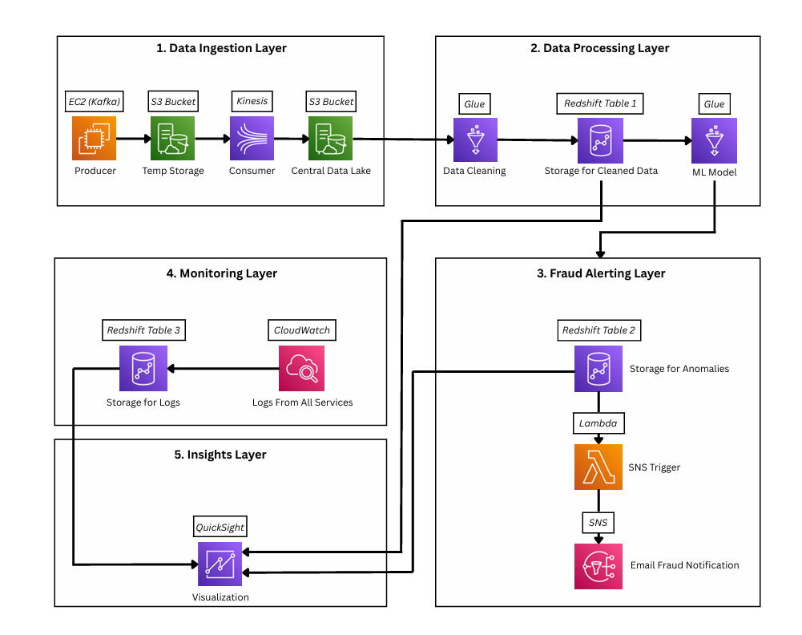
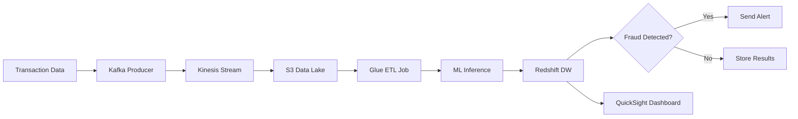
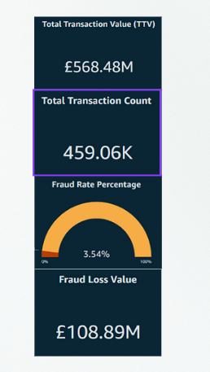
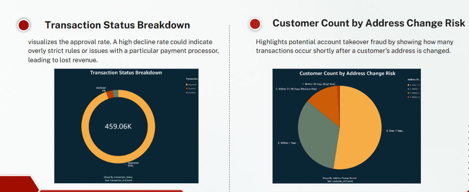
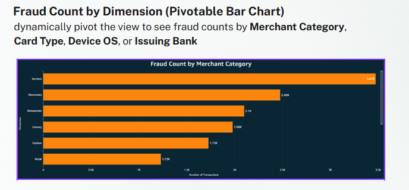
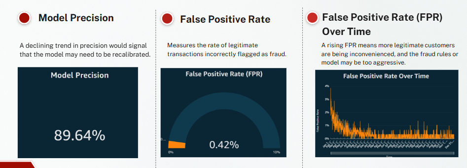
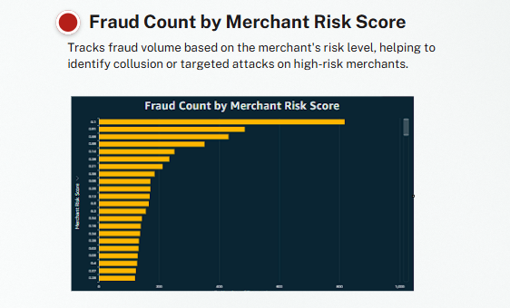

<div align="center">
  
</div>

<p align="center">
  
  
  
  
  
  
  
  
  
</p>

<p align="center">
  
  
  
</p>

---

## 🚀 Project Overview

This repository contains a comprehensive, cloud-native financial fraud detection system built on Amazon Web Services (AWS). The system ingests, processes, and analyzes high-velocity transaction data to identify and alert on fraudulent activity in near real-time, reducing detection latency from hours to minutes.

> **🎓Capstone Project** - Developed for the Information Technology Institute (ITI) graduation program

### ✨ Key Highlights

- **Real-time Processing**: Sub-minute fraud detection and alerting
- **Event-driven Architecture**: Scalable, serverless, and cost-effective
- **Advanced ML**: 97.91% accuracy with XGBoost algorithm
- **Rich Analytics**: Interactive dashboards and comprehensive monitoring
- **Enterprise Security**: VPC isolation and IAM best practices

## 📋 Table of Contents

- [🏗️ System Architecture](#-system-architecture)
- [💡 Key Features](#-key-features)
- [🛠️ Technology Stack](#️-technology-stack)
- [🤖 Machine Learning Model](#-machine-learning-model)
- [📊 Data Pipeline](#-data-pipeline)
- [🔔 Alerting System](#-alerting-system)
- [📈 Analytics Dashboard](#-analytics-dashboard)
- [📁 Project Structure](#-project-structure)
- [🔒 Security](#-security)
- [📚 Documentation](#-documentation)
- [👥 Contributors](#-contributors)
- [📄 License](#-license)

## 🏗️ System Architecture

<div align="center">
  
</div>

### 🏛️ Architectural Layers

| Layer | Purpose | Key Components |
|-------|---------|----------------|
| **Ingestion** | High-throughput data capture | Apache Kafka, Amazon Kinesis, S3 |
| **Processing** | Serverless ETL and ML inference | AWS Glue, Step Functions |
| **Alerting** | Real-time fraud notifications | Lambda, SNS, SES |
| **Analytics** | Business intelligence & monitoring | QuickSight, CloudWatch, Redshift |
| **Security** | Infrastructure protection | VPC, IAM, Secrets Manager |

## 💡 Key Features

### 🚀 High-Performance Ingestion
- **Apache Kafka** cluster for durable message buffering
- **Amazon Kinesis** for scalable stream processing
- **S3 Data Lake** for centralized storage with lifecycle policies

### 🤖 Intelligent Fraud Detection
- **XGBoost Model** with 97.91% accuracy
- **Real-time Inference** on streaming data
- **Multiple Fraud Patterns** detection (account takeover, velocity attacks, etc.)

### 📈 Enterprise Analytics
- **QuickSight Dashboards** for executive reporting
- **CloudWatch Monitoring** with custom metrics
- **Redshift Data Warehouse** optimized for analytical queries

### 🔄 Full Automation
- **Step Functions** orchestration
- **Serverless Architecture** with auto-scaling
- **Error Handling** and retry mechanisms

## 🛠️ Technology Stack

<details>
<summary><b>🔧 Core Technologies</b></summary>

| Category | Technologies |
|----------|--------------|
| **Cloud Platform** | Amazon Web Services (AWS) |
| **Data Streaming** | Apache Kafka, Amazon Kinesis |
| **Data Storage** | Amazon S3, Amazon Redshift |
| **Data Processing** | AWS Glue (PySpark) |
| **Machine Learning** | Python, XGBoost, Scikit-learn, Pandas |
| **Orchestration** | AWS Step Functions |
| **Serverless** | AWS Lambda |
| **Messaging** | Amazon SNS, Amazon SES |
| **Analytics** | Amazon QuickSight |
| **Security** | VPC, IAM, Secrets Manager |
| **Monitoring** | Amazon CloudWatch |

</details>

## 🤖 Machine Learning Model

### 📊 Model Performance

<div align="center">

| Metric | Score | Description |
|--------|--------|-------------|
| **Accuracy** | `97.91%` | Overall classification accuracy |
| **Precision** | `84.12%` | True fraud / (True fraud + False positive) |
| **Recall** | `97.50%` | True fraud / (True fraud + False negative) |
| **F1-Score** | `90.32%` | Harmonic mean of precision and recall |
| **Cross-Val F1** | `94.17%` | Cross-validated F1 score |
| **AUC-ROC** | `1.00` | Area under the ROC curve |

</div>

### 🕵️ Fraud Scenarios Detected

- **Account Takeover**: Unauthorized access patterns
- **Card Testing**: Small transaction probing
- **Velocity Attacks**: Rapid transaction sequences  
- **Impossible Travel**: Geographically impossible transactions
- **Synthetic Identity**: Artificially created identities

## 📊 Data Pipeline

### 🔄 Processing Workflow



### 📈 Data Flow Stages

1. **Ingestion**: Kafka → Kinesis → S3
2. **Processing**: Glue ETL → Feature Engineering
3. **Inference**: XGBoost Model → Fraud Scoring
4. **Storage**: Results → Redshift Data Warehouse
5. **Alerting**: Lambda → SNS → Email Notifications
6. **Analytics**: QuickSight → Interactive Dashboards

## 🔔 Alerting System

### 📧 Alert Configuration

The system sends immediate email alerts when fraud is detected:

- **High Priority**: Fraud score > 0.9
- **Medium Priority**: Fraud score 0.7 - 0.9
- **Low Priority**: Fraud score 0.5 - 0.7

### 🚨 Alert Content

- Transaction details
- Fraud probability score
- Detected patterns
- Recommended actions

## 📈 Analytics Dashboard

### 📊 Key Performance Indicators

- **Transaction Volume**: Real-time processing metrics
- **Fraud Detection Rate**: Percentage of transactions flagged
- **False Positive Rate**: Model accuracy indicators
- **Response Time**: Alert latency measurements

### 📋 Dashboard Sections

1. **Executive Summary**: High-level KPIs and trends
2. **Fraud Analysis**: Detailed fraud pattern breakdowns
3. **Model Performance**: ML model accuracy and drift monitoring
4. **Operational Metrics**: System health and performance

### 📊 Key Insights & Analytics

Our QuickSight dashboard provides comprehensive fraud detection insights including:

- **Total Transaction Value**: Real-time transaction volume monitoring
- **Total Transaction Count**: Transaction frequency analysis
- **Fraud Rate Percentage**: System-wide fraud detection rates
- **Fraud Loss Value**: Financial impact assessment
- **Transaction Status Breakdown**: Status distribution analytics
- **Customer Count by Address Change Risk**: Risk profiling by address changes
- **Fraud Count by Dimension**: Pivotable bar chart for multi-dimensional analysis
- **Model Precision**: ML model accuracy metrics
- **False Positive Rate**: Model performance indicators
- **False Positive Rate Over Time**: Temporal FPR trend analysis
- **Fraud Count by Merchant Risk Score**: Merchant-based risk assessment

### 📸 Dashboard Screenshots

<div align="center">
  
  
</div>

<div align="center">
  
  
</div>

<div align="center">
  
</div>

## 📁 Project Structure

```
Fraud-Detection-ITI-Graduation-Project/
├── AWS GLUE/
│   ├── ETL JOB
│   └── ML Prediction Job
├── Architecture/
│   └── fraud_arch.png
├── Data Warehouse/
│   └── Data Warehouse.png
├── Docs/
│   └── Real-Time Financial Fraud De...
├── Email-Alert/
│   ├── Alert-Lambda.py
│   └── README.md
├── Ingestion-Layer/
│   ├── Consumer
│   ├── kafka-configs
│   ├── Producer
│   └── fraud_data_generator
├── .env
├── docker-compose.yml
├── Insights/
│   ├── 1.png
│   ├── 2.png
│   ├── 3.png
│   ├── 4.png
│   └── 5.png
├── Machine Learning/
│   ├── Fraud-Detection-Model.ipynb
│   ├── xgb_fraud_model.pkl
│   ├── xgb_fraud_model_pkl_4
│   └── README.md
```

## 🔒 Security

### 🛡️ Security Measures

- **VPC Isolation**: All resources within private subnets
- **IAM Least Privilege**: Role-based access control
- **Data Encryption**: At rest (S3, Redshift) and in transit (TLS)
- **Secrets Management**: AWS Secrets Manager for credentials
- **Network Security**: Security groups and NACLs
- **Audit Logging**: CloudTrail for API calls

### 🔐 Security Best Practices

- Regular security assessments
- Automated vulnerability scanning
- Multi-factor authentication
- Regular credential rotation

## 📚 Documentation

**[📖 Real-Time Financial Fraud Detection System](Docs/Real-Time%20Financial%20Fraud%20Detection%20System.pdf)**

Comprehensive project documentation including detailed system architecture, implementation details, and technical specifications.

## 🚧 Limitations & Future Work

### ⚠️ Current Limitations

- Synthetic data may not match real-world complexity
- Near real-time processing (not true real-time)
- Static model without automated retraining
- Limited to financial transaction fraud

### 🔮 Future Enhancements

- **MLOps Integration**: Automated model retraining with SageMaker
- **Explainable AI**: SHAP integration for model interpretability
- **True Real-time**: Streaming ML inference with Kinesis Analytics
- **Multi-cloud**: Support for Azure and GCP
- **Advanced Fraud Types**: Credit card, insurance, and identity fraud

## 👥 Contributors

- Seif El-Deen Gaber
- Omar Adel
- Yasmine Samir
- Abdelrahman Wael
- Ahmed Srour

**Project Supervisor:** Ibrahim Mohamed

### 🎓 Institution

**Information Technology Institute (ITI)**  
*Big Data and Data Science Track*

---

## 📄 License
This project is licensed under the MIT License - see the [LICENSE](LICENSE) file for details.
<p align="left">
  
</p>
<div align="center">
  
</div>
<div align="center">
**If this project helped you, please give it a star!**
</div>
